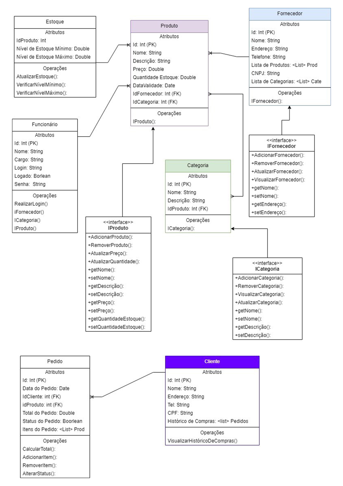

<h1>Resumo do Projeto: Sistema de Controle de Estoque</h1>

<h2>Objetivo do Projeto:</h2>
O objetivo deste projeto é desenvolver um sistema de gestão de estoque eficaz, com a finalidade de melhorar a administração de produtos. O foco central é criar uma ferramenta que ofereça uma visão imediata e completa das quantidades de produtos disponíveis no inventário da empresa. Este sistema visa reduzir ou eliminar perdas decorrentes de problemas no controle de estoque, evitando tanto a falta de produtos quanto o vencimento de produtos.
O projeto busca otimizar significativamente os processos de solicitação e reposição de itens em estoque, visando aumentar a eficiência operacional e minimizar potenciais interrupções nas atividades comerciais. Portanto, o principal propósito deste projeto é fortalecer a capacidade de tomada de decisão e atender às demandas do “mercado” de forma precisa, eficiente e ágil, impulsionando à gestão de estoque e, por consequência, melhorando a competitividade da organização.

<h2>Tecnologias Utilizadas:</h2>
Este projeto de controle de estoque será desenvolvido como uma aplicação web, empregando as tecnologias .NET 6.0 e MySQL. Essas tecnologias serão integradas para criar uma solução eficiente de gerenciamento de estoque.

<h2>Descrição do Sistema:</h2>
A aplicação web resultante permitirá que os colaboradores da empresa, com base no do nível de autorização, realizem uma variedade de operações relacionadas ao estoque. Isso incluirá a capacidade de adicionar novos produtos, atualizar informações sobre produtos existentes, verificar o estado atual do estoque, gerar relatórios sobre a disponibilidade de itens e também conseguir verificar os itens que estão próximos da sua data de validade.

<h2>Principais Funcionalidades:</h2>
Cadastro de produtos: Funcionários autorizados poderão adicionar informações detalhadas sobre novos produtos, incluindo nome, descrição, preço, quantidade inicial, etc.
Atualização de estoque: O sistema permitirá a atualização contínua do estoque à medida que os produtos forem comprados, vendidos ou recebidos.
Busca de itens: Serão disponibilizados relatórios detalhados sobre o desempenho do estoque, incluindo vendas, entradas, saídas e níveis de estoque mínimo e máximo.
Notificações de estoque baixo: Os responsáveis pelo estoque receberão notificações automáticas quando o nível de estoque de um produto atingir um limite mínimo definido.
Autenticação e níveis de acesso: O sistema terá diferentes níveis de acesso, permitindo que funcionários com diferentes responsabilidades acessem apenas as funcionalidades relevantes.
Histórico de transações: Um registro completo de todas as transações de estoque será mantido para fins de auditoria e rastreamento.

<h2>Benefícios Esperados:</h2>

•	Redução de custos devido a menos desperdício de produtos obsoletos.

•	Maior eficiência operacional no gerenciamento de estoque.

•	Melhor controle sobre a disponibilidade de produtos para atender às demandas dos clientes.

•	Tomada de decisões baseada em dados, com relatórios mais precisos.

•	Melhoria na experiência do cliente devido à disponibilidade consistente de produtos.

 

<h2>Funcionalidades Descritivo Resumido</h2>
<h3>Estoque:</h3>

• AtualizarEstoque(): Atualiza as informações de estoque de produtos.

•	VerificarNívelMínimo(): Verifica se o estoque está abaixo do nível mínimo.

•	VerificarNívelMáximo(): Verifica se o estoque está acima do nível máximo.

<h3>Produto:</h3>

•	AdicionarProduto(): Adiciona um novo produto ao sistema.

•	RemoverProduto(): Remove um produto do sistema.

•	AtualizarPreço(): Atualiza o preço de um produto.

•	AtualizarQuantidade(): Atualiza a quantidade de um produto em estoque.

•	getQuantidadeEstoque(): Obtém a quantidade em estoque de um produto.

•	setQuantidadeEstoque(): Define a quantidade em estoque de um produto.

<h3>Fornecedor:</h3>

•	AdicionarFornecedor(): Adiciona um novo fornecedor ao sistema.

•	RemoverFornecedor(): Remove um fornecedor do sistema.

•	AtualizarFornecedor(): Atualiza informações de um fornecedor.

•	VisualizarFornecedor(): Exibe informações de um fornecedor.

•	getNome(): Obtém o nome do fornecedor.

•	setNome(): Define o nome do fornecedor.

•	getEndereço(): Obtém o endereço do fornecedor.

•	setEndereço(): Define o endereço do fornecedor.

<h3>Categoria:</h3>

•	AdicionarCategoria(): Adiciona uma nova categoria de produto ao sistema.

•	RemoverCategoria(): Remove uma categoria de produto do sistema.

•	VisualizarCategoria(): Exibe informações sobre uma categoria.

•	AtualizarCategoria(): Atualiza informações de uma categoria.

•	getNome(): Obtém o nome da categoria.

•	setNome(): Define o nome da categoria.

•	getDescrição(): Obtém a descrição da categoria.

•	setDescrição(): Define a descrição da categoria.

<h3>Funcionário:</h3>

•	RealizarLogin(): Permite que um funcionário faça login no sistema.

•	iFornecedor(): Interface para operações relacionadas a fornecedores.

•	ICategoria(): Interface para operações relacionadas a categorias.

•	IProduto(): Interface para operações relacionadas a produtos.

<h2>Conclusão:</h2>
Este projeto visa aprimorar significativamente a gestão de estoque da empresa, tornando-a mais eficiente, precisa e ágil. A implementação bem-sucedida deste sistema trará benefícios tanto internos quanto externos, resultando em economias de custos e aumento da satisfação do cliente.
